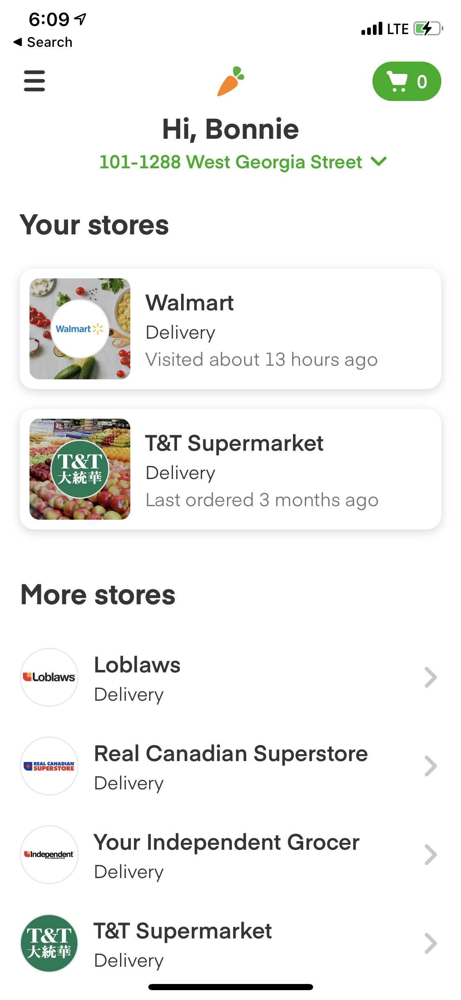
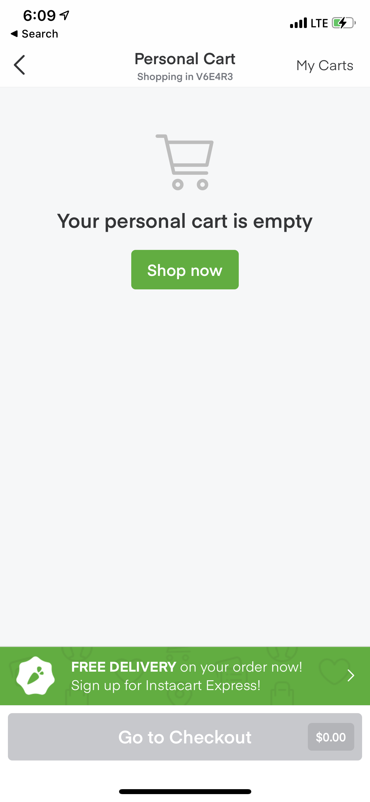
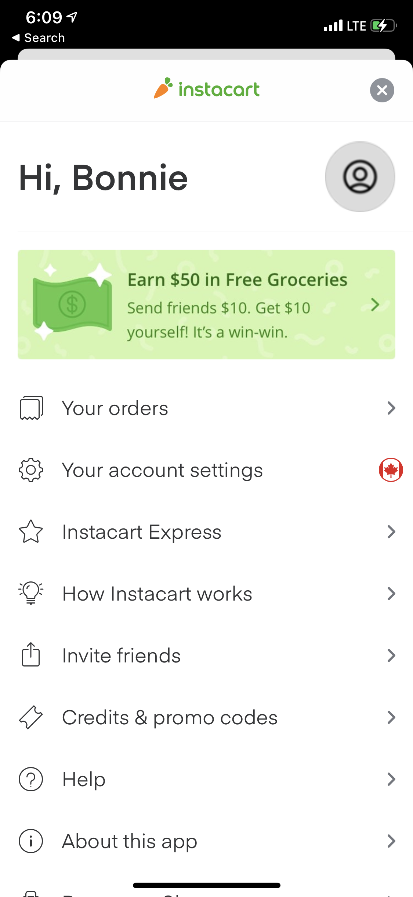
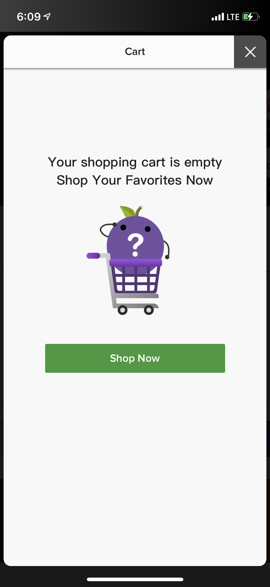

# DH150-BonnieLee
## Assignment 1: Heuristic Evaluation

### Project: Grocery Shopping App
I am Bonnie Lee and I am currently taking DH 150: User Experience Design with Professor Sookyung Cho. For my project, I will be designing an online grocery delivery app for middle-aged women. Following the COVID-19 pandemic, online grocery shopping platforms such as Instacart have been rising in popularity as consumers find alternatives to in-person grocery shopping. I believe this platform would allow middle-aged women to have a quick and seamless online grocery shopping experience! These platforms typically have both a web and mobile version -- I will focus on the mobile app version since I have found that it typically has more usability issues than the web version. The competitors I am analyzing today are the iOS app versions of Instacart and HKTVmall. 

**Note:** Severity ratings during the heuristics evaluation will be based as follows:
* **0 =** This is not a usability problem at all
* **1 =** Cosmetic problem only: need not be fixed unless extra time is available on project
* **2 =** Minor usability problem: fixing this should be given low priority
* **3 =** Major usability problem: important to fix, so should be given high priority

## App 1: Instacart 

[Download Link](https://apps.apple.com/us/app/instacart-groceries-delivery/id545599256) | [Demo Video](https://www.youtube.com/watch?v=FbBU-ATJNKU&ab_channel=HKTVmall)

  

### Brief Information 
Instacart is a grocery delivery and pick-up service based in North America, which allows customers to order groceries from participating retailers, with shopping done by a personal shopper.

### Overall Evaluation
By offering an alternative to in-person grocery shopping, Instacart addresses a critical pain point for those who are unable or unwilling to visit the store, especially those with health concerns during the COVID-19 pandemic. Although the web version is generally intuitive and easy to use, the mobile app has some key usability issues that need to be addressed for users to have a seamless and delightful shopping experience.

### Heuristics Evaluation

#### #1: Visibility of system status 
* Always keep users informed about what is going on.
* Provide appropriate feedback within reasonable time. 

**Evaluation (Severity Rating = 2):** During check out, users are able to review and edit details such as address, delivery instructions/time,contact information and payment method before placing the order. They are also able to track real-time status of their delivery, and receive notification updates, which is a good indication of system status. However, when shopping, there is no indication regarding whether a product is running low or unavailable, meaning that users would not be aware until contacted by the personal shopper or receiving the delivery. 

**Possible Solution(s):** Indicate stock availability so customers are informed and receive feedback within reasonable time.

#### #2: Match between system and the real world
* Speak the users' language, with words, phrases and concepts familiar to the user, rather than system-oriented terms. 
* Follow real-world conventions, making information appear in a natural and logical order. 

**Evaluation (Severity Rating = 0):** The Instacart mobile application does a good job with this heuristic. Within a store, items are categorized the same way as grocery store sections in the real world, e.g. frozen, meat, pantry. Moreover, pictures of products are included alongside their descriptions and prices, making them easily identifiable by users. The app uses icons that follow familiar conventions for the ease of users: using a magnifying glass for "Explore", a house for "Home", and a plus sign for "Add to Cart".

#### #3: User control and freedom
* Users often choose system functions by mistake.
* Provide a clearly marked "out" to leave an unwanted state without having to go through an extended dialogue. 
* Support undo and redo. 

**Evaluation (Severity Rating = 2):** One has the freedom to remove the item from their basket at multiple stages until the order is placed. However, there is undo or redo option, meaning that if a user removes an item by mistake, they would have to leave the cart and re-search for the item again. This is a major issue due to the lack of error prevention (will be explained later), making it extremely easily for a user to accidentally remove their item. There is also no "clear all" option for a cart, which would be very useful.

**Possible Solution(s):** Add undo/redo options, as awell as a "clear all" option to increase user control and freedom.

#### #4: Consistency and standards
* Users should not have to wonder whether different words, situations, or actions mean the same thing. 
* Follow platform conventions. 

**Evaluation (Severity Rating = 3):** The categories used to group similar products across stores on Instacart are consistent, making it easy for users to follow. There is consistency between the mobile and web interfaces, thus creating familiarity and allows for a intuitive user experience. General platform conventions are met, with the search bar and store logo being on the top, shopping cart top right, and navigation bar in the bottom. However, there are clear violations of the heuristic in the application. The home icon is only accessible through the "Shop" tab, which can be inconvenient. In addition, there is no clear distinction between the "Shop" and "Explore" tabs, both of which allow users to view products from a particular store. When scrolling through a store's inventory, users are expected to scroll both horizontally and vertically in order to view products, making it confusing and disorienting. 

**Possible Solution(s):** Add a home icon on the top of the screen, allowing users to return to the homepage at any point. Instead of having to scroll in two directions, one could tap to view products from a particular category, then scroll vertically. 

#### #5: Error prevention 
* Even better than good error messages is a careful design which prevents a problem from occurring in the first place. 

**Evaluation (Severity Rating = 2):** As mentioned when discussing Heuristic #3, there is a lack of error prevention regarding removing an item from one's cart. This mistake is highly probable given the touch interface of a mobile app -- one could easily make this mistake while tapping on instruction or for more information on the product. An example of the application fulfilling this heuristic is by preventing users to tap the "Go to Checkout" option until the order minimum for a certain store is reached. In addition, the application uses auto-fill suggestions powered by Google when filling in a delivery address, making it impossible for typo-related errors. A possible improvement would be to use location services to automatically detect a user's location, preventing the action of inputting the wrong location.

**Possible Solution(s):** Add a good error message such a warning or confirmation option, or making it more difficult to remove a product (e.g. by swiping left). 

#### #6: Recognition rather than recall 
* Make objects, actions, and options visible. 
* User should not have to remember information from one part of the dialogue to another.
* Instructions for use of the system should be visible or easily retrievable whenever appropriate. 

**Evaluation (Severity Rating = 0):** There are many good examples of this heuristic throughout the app. The search function in Instacart minimizes the memory load of users by making search history available as well as popular searches. In addition, The "Shop your last order" option and "Your Items" tab allow repeat users to view or place previous orders without having to manually search for items and add them to cart. In addition, the "Usually bought with" function shows complementary items for a particular product.

#### #7: Flexibility and efficiency of use 
* Accelerators -- unseen by the novice user -- may often speed up the interaction for the expert user so that the system can cater to both inexperienced and experienced users. 
* Allow users to tailor frequent actions. 

**Evaluation (Severity Rating = 0):** While a novice user can tap on a item and specify their desired quantity and add it to cart in the next page, an experienced user can use the "+" icon directly on the item and change the quality there. Another example is when scrolling through a store's inventory, an inexperienced user can tap on "View More" on the top-left of each category, while an experienced user could keep scrolling right, opening the same page. The sort and filter options also allow experienced users to access their desired products more quickly. The application is also hyper-personalized, allowing users to easily revisit stores they previously ordered from, or place/view past orders. 

#### #8: Aesthetic and minimalist design 
* Dialogues should not contain information which is irrelevant or rarely needed. 
* Every extra unit of information in a dialogue competes with the relevant units of information and diminishes their relative visibility. 
 
**Evaluation (Severity Rating = 3):** When shopping within a store's page, there are three options in the bottom navigation bar: "Shop," "Explore," and "Your Items". This is highly unnecessary since the three pages display very similar information: the first category in the "Shop" page is "Your Items", the "Explore" page is essentially identical to the "Shop" page except products within each category aren't shown. The amount of irrelevant and duplicate information makes it difficult for users to navigate the application and leads to an unsatisfactory experience. 

**Possible Solution(s):** Remove the "Shop," "Explore," and "Your Items" tabs, and instead one main page for each store, with different view options for a better and simpler shopping experience.

#### #9: Help users recognize, diagnose, and recover from errors 
* Expressed in plain language (no codes)
* Precisely indicate the problem
* Constructively suggest a solution. 

**Evaluation (Severity Rating = 0):** When attempting to check out an order from multiple stores while not reaching the minimum order for a store, users get this message: "There is a $10 per store minimum order. Add more items from \[STORE NAME\] to reach the store order minimum." This is a good exmample of the heuristic, since plain language is used, the problem is precisely indicated, and users are suggested to add items from the particular store, which is a good solution.

#### #10: Help and documentation 
* Even though it is better if the system can be used without documentation, it may be necessary to provide help and documentation. 
* Help  information should be easy to search, focused on the user's task, list concrete steps to be carried out, and not be too large. 

**Evaluation (Severity Rating = 2):** The "How Instacart Works" in the homepage menu is an example of clear documentation, providing a comprehensive overview of the grocery service and how it works. Although the application does provide help information, it is only accessible through the menu of the homepage. The "Help" button opens the Instacart Help Center website on a web browser, taking users away from the app. The website is organized well, proving contact information, a search option, and separates information by topics. However, the help information is not specific to the mobile version of Instacart, and does not provide instruction on how to navigate the application. 

**Possible Solution(s):** Add a question mark icon on the top left corner of each page of the application, so users can access it at all times. 

## App 2: HKTVmall
[Download Link](https://apps.apple.com/hk/app/hktvmall-online-shopping/id910398738?l=en) | [Demo Video](https://www.youtube.com/watch?v=PksAfCz6akw&ab_channel=Instacart)

  

### Brief Information 
Based in Hong Kong, HKTVmall is an online one-stop shopping and entertainment platform that sells everything from groceries to clothes to electronics.

### Overall Evaluation
I primarily analyzed the "Supermarket" category although HKTVmall sells a wide variety of products, since that is what Instacart and my project will focus on. Although the platform is a very convenient way to shop, it is incredibly overwhelming due to the excessive amount of promotions and irrelevant information, leading to a negative user experience.

### Heuristics Evaluation

#### #1: Visibility of system status 
* Always keep users informed about what is going on.
* Provide appropriate feedback within reasonable time. 

**Evaluation (Severity Rating = 0):** When browsing, users are provided with a lot of information about their product: name, photo, consumer ratings and price. Users can also see the amount of that item previously sold, and time it takes to ship. This information will allow consumers to make smarter and more informed purchasing decisions. When performing an action such as adding an item to cart, a loading gear will appear and a confirmation "Add to Cart" will pop up, an example of feedback provided at a reasonable time. If a transaction does not go through for any reason, one would receive a notification with more information almost instantly.

#### #2: Match between system and the real world
* Speak the users' language, with words, phrases and concepts familiar to the user, rather than system-oriented terms. 
* Follow real-world conventions, making information appear in a natural and logical order. 

**Evaluation (Severity Rating = 3):** Like Instcart, HKTVmall provides pictures of products for users to see while browsing, and icons such as notification bells and hearts follow real-world conventions. Moreover, promotional announcements are presented as they would in physical supermarkets. However, terms such as "Insurance Order" and "My Mall Dollar" are system-oriented and not familiar to the user. In addition, each store uses their own terminology when announcing promotions, making it unfamiliar to users. 

**Possible Solution(s):** Use real-world language as opposed to system-oriented language.

#### #3: User control and freedom
* Users often choose system functions by mistake.
* Provide a clearly marked "out" to leave an unwanted state without having to go through an extended dialogue. 
* Support undo and redo. 

**Evaluation (Severity Rating = 0):** Users have the freedom to make edits to their shopping cart at any point until confirming check out: they can change desired quantity and remove items from cart. Selecting multiple items to remove and "Select All" options are available as well. When viewing a non-shopping page, e.g. the shopping cart, there is a clear "X" in the top right, easily allowing users to leave the unwanted state with the click of a button. The app also has a "back" icon on the top left at all times, which allows users to navigate to the previously visited page, essentially functioning as undo. 

#### #4: Consistency and standards
* Users should not have to wonder whether different words, situations, or actions mean the same thing. 
* Follow platform conventions. 

**Evaluation (Severity Rating = 3):** Similar to Instacart, the web and mobile versions are consistent with each other, and icons used throughout the app meet platform conventions. However, there are many examples in which consistency and standards are not upheld in this app: as mentioned when evaluating heuristic #2, the terminology between stores is not consistent, making it difficult for users to follow. In addition, upon scrolling down on the shopping page, the design for the "categories" section changes completely, confusing users. There is also mention of terms such as "e-Gift Vouchers," "e-Coupons," "Voucher Code" and "My Mall Dollar" in different parts of the app, and it is unclear whether they are suppposed to mean the same thing. There is also inconsistency throughout the platform in terms of product display and promotions. There are both English and Chinese versions of the apps, but language does not remain consistent -- when in the English version, some pages linked (e.g. FAQ) are in Chinese, which would be very confusing for those who do are unable to read the language.

**Possible Solution(s):** Standardize terminology throughout the application to allow for easier user comprehension, and use consistent method to display products and deals. Ensure that all pages of the application are in the the user-selected language.

#### #5: Error prevention 
* Even better than good error messages is a careful design which prevents a problem from occurring in the first place. 

**Evaluation (Severity Rating = 1):** Before removing an item from their cart, users are asked to confirm their action first, making it easy for users to prevent accidentally doing so. When asked for a delivery address, uers aren't able to manually input their address, but rather select their district, then the specific street, then building, then floor and flat, from a drop-down list. This is an example of error prevention since it prevents typo-related errors, and only allow for addresses that are recognized by the system. Although this is error prevention, this is incredibly time consuming and is a poor example of heuristic #2, #4 and #8, since this does not follow real-world or platform conventions, and makes users deal with irrelevant information.

#### #6: Recognition rather than recall 
* Make objects, actions, and options visible. 
* User should not have to remember information from one part of the dialogue to another.
* Instructions for use of the system should be visible or easily retrievable whenever appropriate. 

**Evaluation (Severity Rating = 0):** When searching with the HKTVmall app, users see popular searches as well as their own recent searches, lessening cognitive load. Lists are also automatically generated from a user's past history: "Wishlist", "Purchased Item", "Recently Viewed", "Scanned History". In addition, the personalized homepage includes recommendations based on purchase history and recently viewed items. When viewing a particular product, the app also displays similar products for users to choose from and view.

#### #7: Flexibility and efficiency of use 
* Accelerators -- unseen by the novice user -- may often speed up the interaction for the expert user so that the system can cater to both inexperienced and experienced users. 
* Allow users to tailor frequent actions. 

**Evaluation (Severity Rating = 0):** A novice user could tap the back button on the top left to go back to the previously visited pages, while an experienced one can just swipe left. In addition, instead of the default search that novice users use, experienced users are able to sort and filter search results. They are also able to directly browse products from various stores, leading to a more refined experience. Another example is the ability for experienced users to directly add items to cart from the general store page, and novice users can do so after tapping in and giong on the specific product's page.

#### #8: Aesthetic and minimalist design 
* Dialogues should not contain information which is irrelevant or rarely needed. 
* Every extra unit of information in a dialogue competes with the relevant units of information and diminishes their relative visibility. 
 
**Evaluation (Severity Rating = 3):** On the whole, the application is highly cluttered with a lot of irrelevant details, making the user experience very overwhelming. One example of this would be the incessant pop-ups -- although this is a good example of heuristic #1 since it informs users about current promotions, it is incredibly distracting. Users have to scroll and filter through a large number of irrelevant ads and promotions before being able to find the product they desire, with the inconvenience easily discouraging users. The application also includes overly comprehensive information about each product -- although some users may appreciate the lengthy desciprtions, most would find the large bodies of text unneeded. 

**Possible Solution(s):** Significantly reduce the number of promotions/deals and focus on the products; eliminate or significantly decrease the frequency of pop-ups. Instead of including long descriptions about a particular product, add a collapsable "more information" tab for users to click into if they want to learn more.

#### #9: Help users recognize, diagnose, and recover from errors 
* Expressed in plain language (no codes)
* Precisely indicate the problem
* Constructively suggest a solution. 

**Evaluation (Severity Rating = 0):** The application demonstrates this heuristic well, with the following being an example: "Thank you for shopping at HKTVmall. Unfortunately, the transaction regarding your order \[redacted\] cannot be completed with the selected payment method. Please verify your payment information, you may add the items to your shopping cart and proceed to checkout again." Written in plain language, the error message identifies that the payment method was the problem, and clearly suggests the solution of verifying payment information.

#### #10: Help and documentation 
* Even though it is better if the system can be used without documentation, it may be necessary to provide help and documentation. 
* Help  information should be easy to search, focused on the user's task, list concrete steps to be carried out, and not be too large. 

**Evaluation (Severity Rating = 0):** Upon creating an account, users are shown a Quick Start Guide that introduces core features and demonstrates how to properly use the application. The Quick Start Guide, as well as a "Tutorial" are both accessible in the app's "Account" page, making it easily accessible. In addition, the application's help center categorizes general questions, making it easy for users to find what they're looking for. There is also a live help chatbot function, where users can type in their issues and get assisted by the artificial intelligence immediately.
