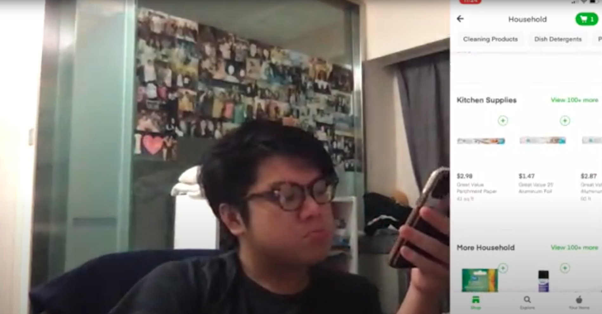

# DH150-assignment08-BonnieLee

## Introduction
For my DH 150 project, I will be designing an online grocery delivery app for middle-aged women. Following the COVID-19 pandemic, online grocery shopping platforms such as Instacart have been rising in popularity as consumers find alternatives to in-person grocery shopping. I believe this platform would allow middle-aged women to have a quick and seamless online grocery shopping experience! These platforms typically have both a web and mobile version -- I will focus on the mobile app version since I have found that it typically has more usability issues than the web version. 

## Design Statement
My project will support users by allowing them to order groceries online, without having to physically visit the grocery store. The activity of buying groceries fulfills the user's physiological needs, since groceries include food and water, which is a fundamental physical requirement for human survival. With the pandemic, ordering groceries online also fulfills a user's safety needs, as users can order groceries from their own home instead of in-person, thus lowering their risk of COVID-19 exposure.

## Competitor Analysis
To start off the user experience research process, I performed a competitor analysis with two online grocery applications on the market, namely the iOS app versions of Instacart and HKTVmall. This involved a heuristic evaluation based on Jakob Nielson’s 10 usability heuristics for user interface design, and a usability test to determine a user's ability in completing routine tasks on the platform.

### Heuristic Evaluation
Competitor |Instacart | HKTVmall
-------- | --------- | ---------
**Links** | [Download Link](https://apps.apple.com/hk/app/hktvmall-online-shopping/id910398738?l=en) \| [Demo Video](https://www.youtube.com/watch?v=PksAfCz6akw&ab_channel=Instacart) | [Download Link](https://apps.apple.com/hk/app/hktvmall-online-shopping/id910398738?l=en) \| [Demo Video](https://www.youtube.com/watch?v=PksAfCz6akw&ab_channel=Instacart)
**Screenshots** |   |   
**Brief Information** | Instacart is a grocery delivery and pick-up service based in North America, which allows customers to order groceries from participating retailers, with shopping done by a personal shopper. | Based in Hong Kong, HKTVmall is an online one-stop shopping and entertainment platform that sells everything from groceries to clothes to electronics.
**Overall Evaluation** | By offering an alternative to in-person grocery shopping, Instacart addresses a critical pain point for those who are unable or unwilling to visit the store, especially those with health concerns during the COVID-19 pandemic. Although the web version is generally intuitive and easy to use, the mobile app has some key usability issues that need to be addressed for users to have a seamless and delightful shopping experience. | I primarily analyzed the "Supermarket" category although HKTVmall sells a wide variety of products, since that is what Instacart and my project will focus on. Although the platform is a very convenient way to shop, it is incredibly overwhelming due to the excessive amount of promotions and irrelevant information, leading to a negative user experience.

[Read more...](https://github.com/bonniebonnielee/DH150-BonnieLee/blob/main/README.md)

### Usability Testing
My usability test was conducted using a live iOS version of the Instacart mobile app (version 7.49.0), and focused on the following heuristics: visibility of system status, user control and freedom, and aesthetic and minimalist design. The participant was asked to add products to their cart, add/remove a product from favourites, and see what household products are available in nearby stores.
 

[Read more...](https://github.com/bonniebonnielee/DH150-BonnieLee/tree/main/assignment02)

## User Research
The next step was to conduct contextual inquiry to better understand my target users. I conducted participatory observation research with a member of my target demographic, and is familiar with both in-person and online grocery shopping. The contextual interview started with asking some background questions, then contextual questions and user feedback about the activities.

Here are some of my key findings:
#### Having too many choices can make it difficult to make a decision
> if you're looking for something like say alcoholic beverages, but I don't know any of the brands, they carry actually too many items for me to choose. One thing I find it difficult is say if I want red wine, like they have over 3000 kinds of like red wines. So it's very difficult to find something or choose.

#### The importance of the "filter" function 
> Um, yeah, I need to use the filter because there's too many. And usually I think the one on top. What they show first is the one that I guess pays more on advertisement. So usually I go for the price high to low. 

#### The importance of re-finding previous orderes
> I'm ordering like stuff on a continuous basis. So usually I just look back at my previous... there's a history in my previous invoices. So I just pick it up from there.

#### The importance of a rating system to know more about a product
> Um if they can put in, like say for red wine, um, if there's like a reliable rating system so that like I know the quality, like I'll have more confidence when I pick that item.

#### Comparing online to in-person grocery shopping
> Easier is that I can do it anytime and they deliver door to door, so I don't have to go physically to a shop, you know, all the hassles. The difficult part is I don't actually order fresh produce online because I'm not too comfortable with the idea of the fresh produce like being in the van or something for hours and then being delivered to my home, and even stuff like frozen food like ice cream. I never ordered online because it doesn't, it doesn't seem to be a good idea, like it melted and then get frozen again.

#### The importance of knowing information about the product
> Tool. Oh, it'll be.. it'll be good, like if I can see, maybe virtually some of the products. Like because now, even if you click into a product, you can, well, you can read what's what's written on it, but it seems like sometimes it's not that clear on the size or like. And and especially like the the general comments rating on the product. Um, I want more information on that. 

[Read more...](https://github.com/bonniebonnielee/DH150-BonnieLee/blob/main/assignment04/README.md)

## UX Storytelling
UX storytelling is essential to successful user-centered design, and gives the designer an opportunity to truly step into a user's shoes. By imagining a user's perspective, one could identify why and how a product would be used, and spot pain points more easily. Through user personas, personalized stories and hypothetical scenarios, designers are able to empathize with users and better understand the user's experience when using the product. UX storytelling also eliminates a designer's personal biases, and create a product that is cohesive and focuses on intended users. 

I developed two user personas as a result of my heuristic evaluation and user research: Sandra Brown, a soccer mum who puts family first, and Thomas Chan, a university fresh graduate and software engineer. To identify their goals, motivations, and frustrations, I created empathy maps, scenarios and journey maps for each of the personas.

[Read more...](https://github.com/bonniebonnielee/DH150-BonnieLee/blob/main/assignment05/README.md)

## Low-fidelity Prototype
The purpose of low-fidelity prototyping is to test ideas early in the design process, ensuring that features implemented can achieve intended goals and are helpful for the target user. I wrote the following features as usage scenarios: platform-wide search, filter results, and adding multiple items to cart.

[Here](https://github.com/bonniebonnielee/DH150-BonnieLee/blob/main/assignment06/%5BDH%20150%20Assignment06%5D%20Wireframes%20and%20Wireflows.pdf) are all the wireframes and wireflows from this prototype.

[Here](https://github.com/bonniebonnielee/DH150-BonnieLee/blob/main/assignment06/%5BDH%20150%20Assignment06%5D%20Wireframes%20Test.pdf) are the results of the prototypting test.

[Read more...](https://github.com/bonniebonnielee/DH150-BonnieLee/blob/main/assignment06/README.md)

## Wireframe and Graphic Design Element Variation
[Here](https://www.figma.com/file/ZAVK4rpta9kUjnSUQ9XDAq/HighFi-Prototype?node-id=0%3A1) is a version of the prototype that reflects the usage scenarios and following tasks:
* View list of stores
* View shopping cart
* Rebuy previous order
* Product search
* Add product to cart
* Remove product from cart
* Check Out

## High-Fidelity Prototype
The high-fidelity prototype was created by digitizing wireframes and wireflows that I handdrew, and incorporating feedback I received from testing the low-fidelity prototype. When creating the high-fidelity prototype, I applied graphic design principles to the wireframes, and added colours, interactive compontents, and interactivity to ensure a consistent and satisfying user experience. Since the high-fidelity prototype is interactive and visualizes the UI/UX aspects of my product, it will allow me to gain more detailed feedback and insight on certain parts of the design that aren't possible from the low-fidelity prototype.

<iframe style="border: 1px solid rgba(0, 0, 0, 0.1);" width="800" height="450" src="https://www.figma.com/embed?embed_host=share&url=https%3A%2F%2Fwww.figma.com%2Fproto%2FZAVK4rpta9kUjnSUQ9XDAq%2FHighFi-Prototype%3Fnode-id%3D48%253A591%26scaling%3Dscale-down" allowfullscreen></iframe>

[Read more...](https://github.com/bonniebonnielee/DH150-BonnieLee/tree/main/assignment07)

## Evaluation and Revision History
To test the functionality of my product, I conducted a cognitive walkthrough and impression test with various users, and received feedback and identified opportunities for improvements.

Here are some key findings:
* Users are able to understand the purpose of the application from the main page
* Unclear how to get out of search screen
* Overall pretty organized and easy to navigate
* Wording can be unclear at times

I incorporated the above feedback into my prototype in order to improve my designs. The impression test and cognitive walkthrough were both really useful, since it allowed me to gain an outsider perspective and witness a user go through my product's intended workflow. 

[Read more...](https://github.com/bonniebonnielee/DH150-BonnieLee/tree/main/assignment07)

## Pitch Video

## Conclusion
